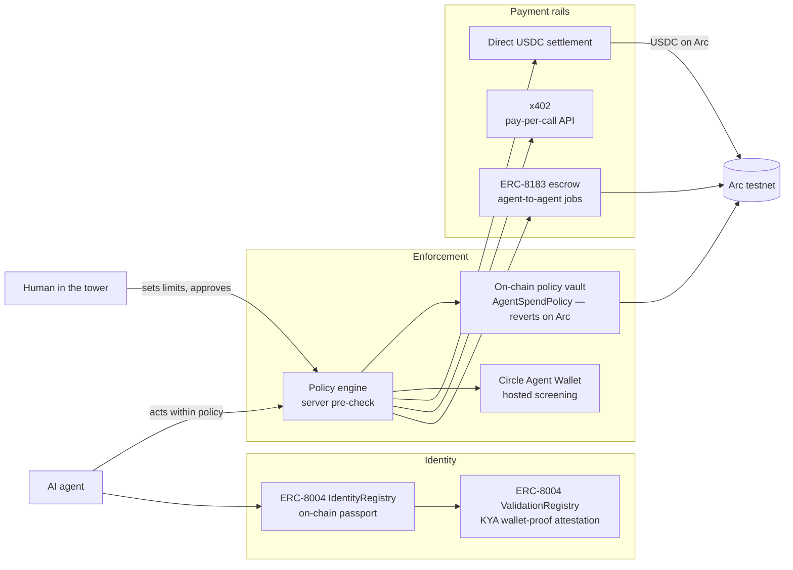

# A-Identity — Architecture (for reviewers)

**A passport (on-chain identity) + wallet (USDC payments) for AI agents, on Circle Arc.**
An agent gets a verifiable identity, proves it controls its wallet, is given spend limits a
human sets, and can then pay other agents — with real value moving in USDC on Arc testnet.

Live: **https://a-identity.xyz** · backend **https://a-identity-backend.onrender.com** · chain **Arc testnet (5042002)**.
Everything below is real code broadcasting real transactions on Arc — no mocks in the core flow.

---

## The flow

## Three independent enforcement layers

A payment is checked in depth — a limit you set is enforced in **three** ways:

1. **Server policy engine** (`mcp/src/platform.ts`) — the pre-check: daily cap, auto-approve
   ceiling, payee allowlist, freeze, human-approval gate (00:00 UTC reset).
2. **On-chain policy vault** (`mcp/contracts/AgentSpendPolicy.sol`) — a per-agent USDC contract
   that enforces the same policy **on Arc**: an over-limit `pay()` *reverts on-chain*. This is the
   trustless source of truth; the server is only the pre-check + fallback. The vault is deployed
   with the human's real wallet as **`owner`** (freeze / override / withdraw) and, in this build,
   the **server signer as the delegated `operator`** that calls `pay()` on the agent's behalf —
   so the *limit* is trustless (the contract reverts regardless of who signs), while *initiating*
   the payment is a delegated action. Roadmap: hand the `operator` role to an agent-held key /
   Circle programmable wallet so the agent signs its own payments end-to-end.
3. **Circle Agent Wallet** (`mcp/src/circle-agent.ts`) — a hosted, Developer-Controlled wallet
   whose policy engine screens each transfer at the wallet layer (sanctions / allow-block / freeze).

`executeInstruction` routes a payment **vault → Circle → direct settlement**, each additive with a
fallback, so one layer failing never fabricates a success.

## Standards

| Standard | Where | What it does |
|---|---|---|
| **ERC-8004** Identity | `0x8004A818…BD9e` | On-chain agent passport (ERC-721). Real `register` tx per agent. |
| **ERC-8004** Validation | `0x8004Cb1B…4272` | **KYA**: the agent signs a challenge (viem `verifyMessage`); the result is attested on the ValidationRegistry (`validationRequest` + `validationResponse=100`, tag `"kya"`). |
| **ERC-8183** Commerce | `0x0747EEf0…4583` | Agent-to-agent job escrow: create → setBudget → approve → fund → submit → complete; USDC held in escrow, released on delivery. |
| **x402** | `mcp/src/x402.ts` | HTTP-402 pay-per-call: server returns 402 + requirements, client pays USDC on Arc, server verifies on-chain (with replay protection) and serves the resource. |
| **Circle Gateway** | `mcp/src/gateway.ts` | Chain-abstracted USDC: deposit on Arc → a unified balance, then move it to Base Sepolia via the Forwarding Service (signed EIP-712 burn intent). Minted on Base in <500 ms, gaslessly. Permissionless — no Circle API key. |
| **Circle Nanopayments** | `mcp/src/nanopay.ts` | The second x402 rail: the `exact`/`GatewayWalletBatched` scheme. Buyer signs an **EIP-3009 authorization off-chain (0 gas)**; Circle Gateway verifies + credits instantly and **batches** the on-chain settlement — sub-cent USDC becomes economical. Permissionless on Arc testnet (`@circle-fin/x402-batching`); buyer balance = the same Gateway Wallet deposit (`0x0077…19b9`). |
| **Circle CCTP** | `mcp/src/cctp.ts` | Native USDC cross-chain by **burn-and-mint** (CCTPv2 via `@circle-fin/bridge-kit`): burn on Arc → attest → mint natively on Base Sepolia (never wrapped). Canonical bridge, distinct from Gateway's unified-balance forwarding. |

> Circle products used: **USDC, Wallets, Gateway, Nanopayments, CCTP** — all live on Arc testnet.
> **USYC / StableFX** are enterprise-gated (access by request); we integrate them at the
> architecture level only, and say so — no penalty for conceptual integration per the rules.

## Verifiable on-chain proof (Arc testnet)

- **Showcase agent "Meridian"** — ERC-8004 id **#849980**, KYA attested on-chain, policy vault,
  reputation **536** from 3 real settlements. Anchor tx:
  [`0x506b125f…`](https://testnet.arcscan.app/tx/0x506b125f3a0481667e3a00dcb86f48cbcaa35c643af963365e9389b06a8f8e54) ·
  KYA attestation: [`0x758ddbfa…`](https://testnet.arcscan.app/tx/0x758ddbfad38daeb772a37deb07e65339f13aeb393899fc7e1d2689c95adf0dad)
- **Completed ERC-8183 escrow job #155504** — full lifecycle settled on Arc.
  createJob [`0xcce5a56c…`](https://testnet.arcscan.app/tx/0xcce5a56cc0518d5760f90d11d88eb70d5097636179eb3e92903152a96a684cc5) →
  complete [`0x245f0ee7…`](https://testnet.arcscan.app/tx/0x245f0ee76a6d8dd21e8a14cbd1f489a3d80a1824113316f3b39c58c0e50f25e3)
- **Circle Gateway** — USDC deposited on Arc, then moved to **Base Sepolia gaslessly** via the
  Forwarding Service and minted there in ~6s (verified live on prod). Recipient balance on Base:
  [signer on Basescan](https://sepolia.basescan.org/address/0xd305607510E0Db2c95807173c7A05BEA53c1ed36).

## Stack

- **Frontend** — React + Vite (Vercel). Talks to its own origin; `vercel.json` proxies `/api`, `/mcp`,
  `/health` to the backend (first-party → dodges ad-blocker false "offline").
- **Backend** — Node HTTP + **MCP** (Model Context Protocol) server (Render). REST companion for the UI,
  `/mcp` JSON-RPC for agents. Durable state via Postgres (`DATABASE_URL`), JSON-file fallback for dev.
- **Auth** — Sign-In with Ethereum (wallet) + email magic link (Resend) are *verified*; a plain guest
  session is read-only. Agent ownership is bound to a verified identity.
- **Tests / CI** — `node:test` unit (13) + a full E2E (**38 checks** green without a signer key; the
  on-chain write steps run and add more when a funded `ARC_SIGNER_KEY` is present) in GitHub Actions.

## Honesty guardrails (we say exactly what's true)

- **KYA** = the agent **proves it controls its wallet**, recorded on-chain. It's an
  **operator/wallet-proof attestation, not** an independent third-party audit.
- **Circle** *screens* transfers; it does **not** enforce the USD spend cap — the server + the on-chain
  vault do.
- **Operator custody**: today the **server signer** is the vault `operator` that submits `pay()` on the
  agent's behalf (a delegated action); the human `owner` is the user's own wallet. The *limit* is
  trustless regardless (the contract reverts), but the agent does not yet sign its own payments —
  that's the roadmap (agent-held key / Circle programmable wallet). We say this plainly.
- **Testnet**: Arc testnet, test USDC. Real tech, test money.
