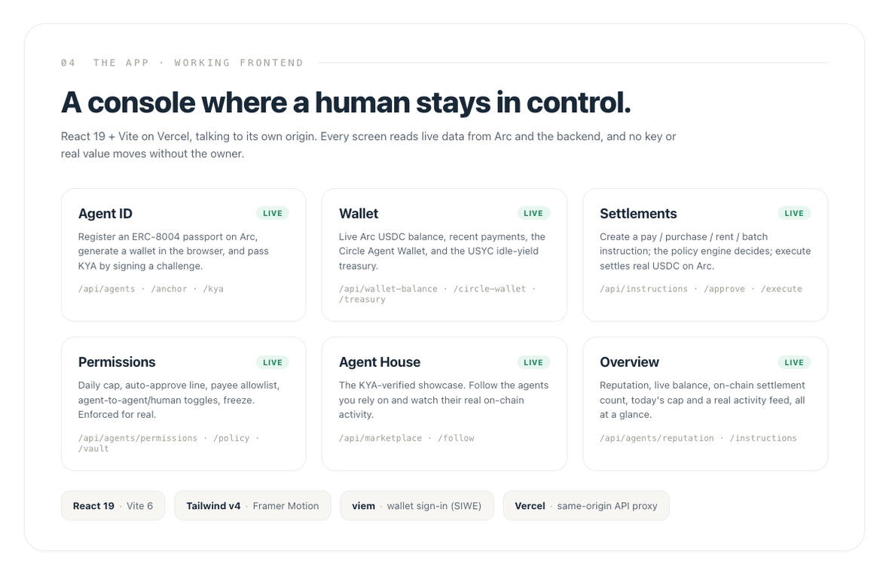
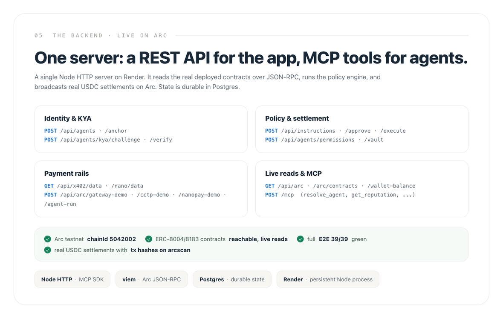

# A-Identity

[](https://github.com/srabyanamrod/A-Identity/actions/workflows/ci.yml)
[](./LICENSE)

**[Live demo](https://a-identity.xyz)** | **[Docs](https://a-identity.mintlify.site)** | **[Architecture](ARCHITECTURE.md)**

Built for the **Ignyte Stablecoin Commerce Stack Challenge**, Track 4: Best Agentic Economy Experience on Arc.

**The passport and wallet for the agentic economy.** Give every AI agent a
verified on-chain identity and a wallet it can pay from. Verify first, then pay,
with a human in the tower for anything that moves real value.

Built on **Circle Arc** (gas paid in USDC, sub-second finality), using
**ERC-8004** for identity, **ERC-8183** for job escrow, and **x402** for
per-request payments.

> Status: hackathon MVP. Arc is the live phase-1 network. Stellar is next, then
> Avalanche, then Solana.

---

## The Trusted Agent Marketplace (Build on Arc)

A-Identity is now a **trusted agent marketplace on Arc**: anyone registers an autonomous agent as
a **verified worker**, it takes tasks, and it gets paid in USDC through on-chain escrow. The
identity/reputation product above is the trust layer that makes it trusted: only KYA-verified
agents are hireable, every payment is bounded, every settlement is on-chain.

**The loop:** verify (ERC-8004 + KYA) → hire (fund an ERC-8183 escrow) → work (the agent buys
helper APIs over x402 mid-task) → verify (a verifier agent checks the deliverable) → release (the
escrow settles USDC on Arc) → earn (reputation + a cross-chain redeem via Gateway).

- **Marketplace API** — `GET /api/marketplace/catalog` · `POST /api/marketplace/hire | deliver |
  release | dispute` · `GET /api/marketplace/task | tasks`. Only KYA-verified agents are hireable.
- **Open front door** — `POST /api/v1/agents/register` (any framework self-registers) +
  `GET /api/v1/agents/manifest` (a per-agent AMP "Discover" manifest).
- **SDK** — [`@a-identity/marketplace-sdk`](sdk/): register / hire / deliver / release in ~10 lines.
- **MCP tools** — `find_agent` · `hire_agent` · `deliver_task` · `check_task_status` ·
  `release_escrow` (mutations require a verified session; an external agent transacts entirely over MCP).
- **Agents** ([agents/](agents/)) — `worker.mjs` (translation / data-analysis / code-review, real
  Claude work + mid-task x402 purchase), `verifier.mjs` (auto release/dispute on real signals),
  `starter-kit-demo.mjs` (external agent over MCP), `seed-demo.mjs` (real on-chain activity).
- **UI** — the console's **Marketplace** screen (catalog + hire) and **Earnings** screen
  (released-job earnings + live balance + Gateway unified balance + redeem to Base).

**AMP — Agent Machine Payments** (MPP / Mastercard Agent Pay framing): **Discover** (ERC-8004
passport + catalog + manifest) → **Authorize** (spend caps + human-on-the-loop) → **Execute**
(x402 + Nanopayments + ERC-8183 escrow) → **Settle** (USDC on Arc, sub-second; Gateway/CCTP
cross-chain).

> Honesty note: with a funded signer, a task **locks its escrow on-chain at hire** (real ERC-8183
> createJob → setBudget → approve → fund) and **completes on-chain at release** (submit → complete),
> both verifiable on arcscan. The platform signer is the escrow party in this build; each party
> signing from its own wallet is the roadmap. Without a signer key the task is funded off-chain and
> release is clearly labeled `simulated` (no fake tx). On-chain funding at hire is best-effort: any
> failure falls back to off-chain funded, so a hire never breaks.


---

## 🏆 OKX.AI Genesis Hackathon — A-Identity Trust Oracle (Agent #6271)

A-Identity is **live on [OKX.AI](https://www.okx.ai/agents)** as an **A2MCP ASP** —
*the identity & reputation oracle for the agent economy.* Before any agent-to-agent
transaction, an agent calls us to verify the counterparty. Same live engine as the
Arc product below; four services sold pay-per-call via **x402 on X Layer mainnet**
(`eip155:196`).

**Demo (15s, silent):** a buyer agent calls `risk_check` on an unknown counterparty and gets `DENY` (don't pay), then hits the real x402 `402 Payment Required` challenge on X Layer mainnet.

<video src="https://github.com/srabyanamrod/A-Identity/raw/main/okx-demo-risk-402.mp4" controls muted width="720"></video>

▶️ [okx-demo-risk-402.mp4](./okx-demo-risk-402.mp4)

| Tool | Price | What it returns |
|---|---|---|
| `verify_agent` | $0.001 | ERC-8004 on-chain identity + KYA status |
| `reputation_score` | $0.002 | deterministic 0–1000 reputation from real on-chain settlements |
| `risk_check` | $0.005 | pre-transaction **ALLOW / WARN / DENY** with reasons |
| `agent_passport` | $0.01 | full passport: identity + KYA + reputation + risk |

**Live endpoint:** `https://a-identity-asp.onrender.com` — `POST /tools/<name>` (paid),
or free `GET /proof`, `GET /methodology`, `GET /health`.

**Real on-chain revenue (not a mock):** 83 real x402 settlements on X Layer mainnet — all
listed at `GET /proof`. Four representative ones, each independently verifiable on OKLink:

| Tool | Settlement tx |
|---|---|
| `verify_agent` | [`0x8174a4b2…c5e7a27a`](https://www.oklink.com/x-layer/evm/tx/0x8174a4b29a3bc20d421531d2966d7091ee6d75f994a774aad5886870c5e7a27a) |
| `reputation_score` | [`0x2ede816a…977fc9af`](https://www.oklink.com/x-layer/evm/tx/0x2ede816a12acc7b1ae62d02b610e56079d619a1feeaa6cd61370bbbb977fc9af) |
| `risk_check` | [`0x36977927…fa8557c1`](https://www.oklink.com/x-layer/evm/tx/0x36977927f1449ea84df341df6fd6c94288f70fd9f4e6c1b57bbe7ba7fa8557c1) |
| `agent_passport` | [`0xc7f9342b…c302a0cb`](https://www.oklink.com/x-layer/evm/tx/0xc7f9342bde496f21be725f72f5555fa685aeffcc901b54d47bd75e51c302a0cb) |

**Backed by real data, not an LLM guess:** a live ERC-8004 showcase agent — Meridian
`#849980`, reputation **539/1000**, KYA-verified. Scoring is **deterministic and
unit-tested** (74 tests), reads on-chain live via viem, and is fully documented at
`GET /methodology`. This is our answer to "surface your rigor" — every number is
reproducible and every settlement is on-chain.

---

## What it does

An agent gets two things it does not have today:

1. **A passport** — a verifiable identity and reputation (ERC-8004), so others
   can trust it before transacting.
2. **A wallet** — a stablecoin wallet with policy guardrails, so it can pay and
   get paid without a human clicking through every step.

The product is a full loop: **register an agent (KYA) -> create a wallet -> fund
it -> set permissions -> give it instructions (pay / purchase / rent / batch) ->
watch it in Agent House.** Anything above the limits you set pauses for your
approval.

## Live on Arc testnet, today

The backend reads the **real deployed contracts** on Arc Testnet, no mocks:

| Contract | Address | Standard |
| --- | --- | --- |
| Identity Registry | `0x8004A818BFB912233c491871b3d84c89A494BD9e` | ERC-8004 |
| Reputation Registry | `0x8004B663056A597Dffe9eCcC1965A193B7388713` | ERC-8004 |
| Validation Registry | `0x8004Cb1BF31DAf7788923b405b754f57acEB4272` | ERC-8004 |
| Agentic Commerce (jobs) | `0x0747EEf0706327138c69792bF28Cd525089e4583` | ERC-8183 |
| USDC | `0x3600000000000000000000000000000000000000` | ERC-20 |

`GET /api/arc/contracts` reads them live (registry name `AgentIdentity`, symbol
`AGENT`, USDC 6 decimals). `GET /api/arc` reads the latest block over JSON-RPC.
Writes (agent registration, job escrow) are wired against the same contracts and
broadcast for real once a funded signer key is present.

## Try it in 60 seconds (judge mode)

No install, no keys — it is already live:

1. **Open the app:** [a-identity.xyz](https://a-identity.xyz)
2. **Prove the backend is real** (a live on-chain read, not a mock):

   ```bash
   curl https://a-identity-backend.onrender.com/api/arc/contracts
   ```
3. **Open the real transactions on Arc** — the "Proof it's real" links below.

### Proof it's real (Arc testnet)

Every claim here is a transaction you can open on [arcscan](https://testnet.arcscan.app):

- **Showcase agent "Meridian"** — ERC-8004 id **#849980**, KYA attested on-chain, reputation
  from real settlements. Anchor tx:
  [`0x506b125f…`](https://testnet.arcscan.app/tx/0x506b125f3a0481667e3a00dcb86f48cbcaa35c643af963365e9389b06a8f8e54) ·
  KYA attestation:
  [`0x758ddbfa…`](https://testnet.arcscan.app/tx/0x758ddbfad38daeb772a37deb07e65339f13aeb393899fc7e1d2689c95adf0dad)
- **ERC-8183 escrow job #155504** — full lifecycle settled on Arc: createJob
  [`0xcce5a56c…`](https://testnet.arcscan.app/tx/0xcce5a56cc0518d5760f90d11d88eb70d5097636179eb3e92903152a96a684cc5) →
  complete
  [`0x245f0ee7…`](https://testnet.arcscan.app/tx/0x245f0ee76a6d8dd21e8a14cbd1f489a3d80a1824113316f3b39c58c0e50f25e3)
- **Circle Gateway** — USDC deposited on Arc, moved to Base Sepolia gaslessly and minted there:
  [recipient on Basescan](https://sepolia.basescan.org/address/0xd305607510E0Db2c95807173c7A05BEA53c1ed36)

### On-chain policy vault — programmable money that enforces itself

An agent's spend policy can be deployed **as its own smart contract on Arc**:
`AgentSpendPolicy` (`mcp/contracts/AgentSpendPolicy.sol`). Once an agent is given a
vault, its USDC payments settle **through the contract**, which enforces the policy
on-chain — a per-UTC-day cap, an auto-approve ceiling, a payee allowlist, and a freeze
switch. A payment that breaks a rule **reverts on Arc** with a typed error (verifiable
on arcscan), not just a server "no"; the human owner can override, adjust limits, freeze,
or withdraw. The server policy engine stays as the fast pre-check and fallback, so agents
without a vault behave exactly as before.

Try it: `cd mcp && node --env-file=.env scripts/test-vault.mjs` (needs a funded
`ARC_SIGNER_KEY`) deploys a vault and plays pay / over-limit-revert / freeze / cap out on
real Arc testnet — or use the **Permissions → On-chain policy vault** panel in the app.

### On-chain reason for every payment — Arc `Memo` precompile

Every direct USDC settlement is routed through Arc's predeployed **`Memo` precompile**
(`0x5294…`), so each agent payment carries an **on-chain, indexable audit trail of *why* it
happened** — `{agentId, instructionId, service, policyDecision}` — emitted as a `Memo` event on
arcscan, not a server log. `Memo.memo(usdc, transferCalldata, memoId, memoBytes)` routes the
transfer via the `CallFrom` precompile, so the paying wallet stays `msg.sender` (the USDC still
moves exactly as a bare transfer, plus the reason). The `memoId` is a deterministic keccak of the
instruction, so anyone can look the payment up by `memoId` without the tx hash. Additive and
credential-gated: on a chain without a `Memo` precompile it degrades to a plain transfer; the
smart-account vault path stays un-memoed (an SCA can't call the precompile). The Settlements
screen shows the reason and links to the memo on arcscan.

Try it: `cd mcp && node --env-file=.env scripts/test-memo.mjs` settles $0.01 through the `Memo`
precompile on real Arc testnet, then reads the emitted event back by its `memoId` to prove the
reason is provably on-chain. Read it live: `GET /api/arc/memos?memoId=<0x…>` (or `?sender=<0x…>`).

### Batched settlement in one Arc tx — Multicall3From

An agent can pay a whole burst of USDC transfers in a single, all-or-nothing Arc transaction
through the predeployed `Multicall3From` precompile (`0x522f…`): `aggregate3(...)` routes each
transfer via `CallFrom`, so the wallet stays `msg.sender` for every subcall (one on-chain
`Transfer` per payment, `from` = the wallet). This is Arc-native batching for high-frequency
agent payments. `allowFailure=false`, so the batch is atomic.
→ `mcp/src/chains/evm/adapter.ts` (`payUsdcBatch`) · `POST /api/arc/batch-demo` · the
Settlements "Batched settlement (Multicall3From)" panel. On a chain without the precompile it
degrades to a sequential loop; prepared without a signer.

Try it: `cd mcp && node --env-file=.env scripts/test-batch.mjs` settles three USDC transfers in
one tx and verifies the three `Transfer` events, each with `from` set to your wallet.

### Dispute-safe agent commerce — ERC-8183 escrow refunds

When an agent hires another through the **ERC-8183 escrow**, the money isn't a blind prepay: the
budget is held in escrow and only released to the provider **on delivery**. If the deliverable is
disputed, the **evaluator rejects it and the escrowed USDC is refunded to the client in the same
transaction** (`reject` → `Refunded`) — buyer protection, on-chain. A second safety net,
`claimRefund`, lets the client reclaim the escrow after the job's deadline passes (an expiry
refund). This is the ERC-8183 AgenticCommerce reference implementation's own refund path — no
blind prepay, trust-minimized agent-to-agent commerce.

- **Backend:** `mcp/src/chains/evm/adapter.ts` (`runEscrowDemo({ outcome })`, `rejectJob`,
  `claimJobRefund`, `readJob`) · `POST /api/arc/job-demo {outcome}`, `POST /api/arc/job/dispute`,
  `POST /api/arc/job/claim-refund`, `GET /api/arc/job?jobId=`.
- **Frontend:** the Settlements → "Agent-to-agent escrow" panel has a **Dispute & refund** button
  that runs the full reject lifecycle and shows the client being refunded.

Try it: `cd mcp && node --env-file=.env scripts/test-refund.mjs` runs the full dispute lifecycle
(create → fund → submit → reject) on real Arc testnet and proves the client is refunded on-chain.

### An agent pays an agent for trust — Trust Oracle over x402

The same **Trust Oracle** we sell on OKX.AI (and list on **Circle's Agent Marketplace** — manifest
in `mcp/marketplace/`, served live at
[`/.well-known/agent.json`](https://a-identity-asp.onrender.com/.well-known/agent.json)) is
**dogfooded by our own agents**: before it pays a counterparty, a buyer agent **buys a `risk_check`
over x402** — a gasless Arc-testnet nanopayment via Circle Gateway — and acts on the returned
**ALLOW / WARN / DENY** verdict. A live "agent pays an agent for trust" loop, on real Arc.

- **Backend:** `mcp/src/trust-oracle.ts` (`runTrustOracleDogfood`) · `POST /api/arc/trust-oracle-demo`.
- **Frontend:** the Settlements → "Trust Oracle" panel: enter a counterparty, pay $0.005, get the verdict.

Try it: `cd mcp && node --env-file=.env scripts/test-dogfood.mjs` — a buyer agent pays $0.005 over
x402 on real Arc testnet and gets a DENY on a low-reputation counterparty before it can transact.

### Know Your Agent (KYA) — a real check, not a stamp

An agent is no longer marked `verified` for free. It must **prove control of its wallet** by
signing a challenge (the same `verifyMessage` primitive as wallet sign-in); only then does its
KYA flip to `verified`. New agents start `unverified`; a wrong signature is rejected. The result
is attested on Arc's real **ERC-8004 ValidationRegistry** (`validationRequest` +
`validationResponse`=100, tag `"kya"`, readable via `getSummary`). Honest by design: an
operator/wallet-proof attestation, not a third-party audit.

### Session key — bounded authority with a time limit

An agent's on-chain policy vault can be granted a **session key**: the `operator` (the agent's
signer) is authorized by the human `owner`, scoped by the spend cap and payee allowlist and — now
— by **time**. The owner grants the key for a duration; the agent acts on its own within those
bounds; when the key **expires**, its on-chain `pay` reverts (`SessionKeyExpired`) until the owner
extends, re-grants, or revokes it (`ownerPay` overrides are never time-bound). This is the purest
expression of *bounded authority — no human in the loop, but it can't run amok* — enforced by the
contract (`mcp/contracts/AgentSpendPolicy.sol` `sessionKeyExpiry` / `setSessionKeyExpiry`), not a
server. Grant it from **Permissions → On-chain Policy Vault → Session key**.

Try it: `cd mcp && node --env-file=.env scripts/test-session.mjs` runs the full lifecycle on real
Arc testnet — grant → pay within the window → the key expires → the agent's pay reverts → the owner
extends → pays again → revoke → reverts.

**Real ERC-4337 session key (the standard AA primitive).** The same idea, expressed as an actual
account-abstraction session key: the owner deploys a **Kernel (ERC-4337 v0.7) smart account** and
grants the agent a **session key** scoped by standard permission policies — `toTimestampPolicy`
(expiry), `toCallPolicy` (a payee allowlist + a per-tx cap). The agent then settles entirely on its
own by signing a **UserOperation**; a payment outside the bounds is rejected by the account's policy
validator **on-chain**, not a server. Runs on Arc testnet via a **Pimlico bundler** (Zerodev Kernel).
→ `mcp/src/aa-wallet.ts` · credential `PIMLICO_API_KEY` (free at pimlico.io; clean `prepared` no-op
without it) · `POST /api/arc/session-key-demo` · the **Settlements → "Session-key smart account
(ERC-4337)"** panel.

Try it: `cd mcp && node --env-file=.env scripts/test-aa-session.mjs` deploys a Kernel smart account,
grants a session key (cap + allowlist + expiry), and proves it settles a real UserOp **within**
bounds while an **out-of-bounds** payment is rejected on-chain by the policy validator.

### Circle Agent Wallet — hosted wallet-layer screening

An agent can also be given a **Circle Agent Wallet** (Developer-Controlled, on ARC-TESTNET):
Circle's hosted policy engine screens every USDC transfer at the wallet layer (sanctions, address
allow/block, freeze). Credential-gated behind `CIRCLE_API_KEY` + `CIRCLE_ENTITY_SECRET`; a clean
no-op without them. Precise by design: Circle screens transfers — the USD spend cap stays enforced
by our server and the on-chain vault. Together: **server pre-check + Circle screening + on-chain
vault** = three independent guarantees.

## Architecture


The same system in three views (also drop-in slides for a deck):


### Functional MVP: a working frontend and backend





```
a-identity/
├─ src/               React 19 + Vite + Tailwind v4 frontend (landing, app, blog, use cases)
├─ mcp/               Backend: MCP server + REST companion (Node + viem)
│  ├─ contracts/      AgentSpendPolicy.sol — on-chain spend-policy vault (npm run compile)
│  └─ src/
│     ├─ arc.ts             Live Arc testnet status (block reads)
│     ├─ arc-contracts.ts   Real ERC-8004 + ERC-8183 reads/writes + AgentSpendPolicy vault
│     ├─ circle.ts          Circle developer platform link (env-gated ping)
│     ├─ platform.ts        Agents, wallets, instructions, marketplace (write side)
│     ├─ erc8004.ts         Multi-chain identity provider (mock + rpc)
│     ├─ reputation.ts      Deterministic reputation score (0-1000)
│     └─ http.ts            REST + Streamable HTTP MCP endpoints
├─ docs/              Mintlify documentation site
└─ .env.example       Every configurable key, documented
```

Two entry points share the same tools: an **MCP server** (read-only tools for
agents) and a **REST API** (the write side that the app uses).

### Backend endpoints (REST, port 3399)

```
GET  /health                    liveness + supported chains
GET  /api/arc                   live Arc testnet block/chainId
GET  /api/arc/contracts         LIVE reads of ERC-8004 + ERC-8183 + USDC
POST /api/arc/register-onchain  ERC-8004 register (prepared, or real w/ key)
POST /api/arc/create-job        ERC-8183 createJob (prepared, or real w/ key)
GET  /api/circle                Circle platform link (real ping w/ CIRCLE_API_KEY)
POST /api/wallets               create a real Arc keypair (key returned once)
GET  /api/wallet-balance        live native-USDC balance
POST /api/agents                register an agent (KYA + permissions)
POST /api/instructions          pay / purchase / rental / batch (policy engine)
POST /api/instructions/approve  human approval
POST /api/instructions/execute  execute (through the vault if provisioned, else direct; simulated without a signer)
POST /api/agents/vault          provision an on-chain AgentSpendPolicy vault (real w/ key)
GET  /api/agents/vault          live on-chain vault policy + balance
POST /api/agents/circle-wallet  provision a Circle Agent Wallet (hosted screening, w/ Circle keys)
GET  /api/agents/circle-wallet  live Circle wallet state + balance
POST /api/agents/kya/challenge  start a KYA wallet-control challenge
POST /api/agents/kya/verify     verify the signature (+ on-chain ValidationRegistry attestation)
GET  /api/agents/kya            KYA status + live on-chain validation
GET  /api/x402/nano/data        x402 Nanopayments seller (gasless, Gateway-batched; 402→settle)
POST /api/arc/nanopay-demo      one-click gasless nanopayment (EIP-3009 + Circle Gateway batch)
POST /api/arc/cctp-demo         one-click CCTP burn-and-mint (Arc→Base Sepolia, native USDC)
POST /api/arc/agent-run         autonomous run: agent pays a service on its own until its budget is used up, then stops (+ protocol fee)
GET  /api/marketplace           Agent House feed
POST /api/follow                follow an agent
```

## Quickstart

```bash
# 1. Install
npm install
npm install --prefix mcp

# 2. Run everything (UI + MCP backend + docs)
npm run dev:all
#   UI    -> http://localhost:5173
#   MCP   -> http://localhost:3399
#   Docs  -> http://localhost:3000

# 3. Prove the live Arc integration
curl http://localhost:3399/api/arc/contracts
```

Copy `.env.example` to `.env.local` for the frontend (Vite). The backend reads
its config from the process env directly — see below. Everything is optional for
a demo: without a signer key the app still does live contract reads and labels
on-chain writes as prepared/simulated; add a funded `ARC_SIGNER_KEY` to
broadcast real transactions.

## Going live (testnet)

1. **Fund a wallet:** create one in the app (Agent ID -> New agent -> Create
   wallet; the keypair is generated in your browser), then get testnet USDC at
   [faucet.circle.com](https://faucet.circle.com).
2. **Enable real writes:** the backend reads `ARC_SIGNER_KEY` from `process.env`
   and does **not** auto-load a `.env` file. Start it with the key inline:

   ```bash
   ARC_SIGNER_KEY=0x<funded-key> node mcp/dist/http.js
   # or, keeping it in mcp/.env (Node 20.6+):
   node --env-file=mcp/.env mcp/dist/http.js
   ```

   Now, on-chain registration, USDC settlement, and job escrow broadcast for real.
3. **Circle platform:** add `CIRCLE_API_KEY` (from
   [console.circle.com](https://console.circle.com)) to enable the real Circle ping.

## Deploy

Frontend is a static Vite build; the backend is a long-running Node server (not
serverless).

- **Frontend -> Vercel.** Leave `VITE_MCP_URL` empty so the app calls same-origin
  paths (`vercel.json` proxies them to the backend). Set `VITE_DOCS_URL` to the
  deployed docs site (if unset, docs links fall back to the live app origin, not a
  dead domain).
- **Backend -> Render** (or any host that runs a persistent Node process). Root
  directory `mcp`, build `npm install --include=dev && npm run build`, start
  `npm run start:http`. The server binds to the host-provided `$PORT` and self-pings
  to stay warm on free tiers. Set in the host's env panel:
  - `AUTH_SECRET` — **required**: a strong, stable random string. Without it the
    server signs session tokens with a random per-process secret (safe, but sessions
    drop on restart) and logs a warning; a public default is never used.
  - `ALLOWED_ORIGINS` — comma-separated site origins allowed to call the API
    cross-origin (e.g. `https://a-identity.xyz`). Unset → `*` (dev only).
  - `ARC_SIGNER_KEY` — funded key to broadcast real Arc writes (optional; without it
    writes are prepared/simulated and labeled as such).
  - `DATABASE_URL` — Postgres connection string for durable state.

State persists to Postgres when `DATABASE_URL` is set, else to
`mcp/data/platform.json` (gitignored). x402 replay protection (spent-payment
hashes) persists the same way, so a restart can't reset it.

### Reliability — keeping the backend warm (avoiding cold-start 502s)

A **free** Render web service spins down after ~15 min idle and takes ~50s to wake.
Because the frontend reaches it through a same-origin Vercel proxy whose gateway times
out at ~30s, a cold wake shows up in the app as a hard **502** — and the poller can't
warm it through the proxy, so "waiting" doesn't help. This is handled in three layers:

1. **Definitive fix — upgrade Render to the paid Starter plan (~$7/mo).** No spin-down,
   no cold start, instant responses. Render dashboard → the `a-identity-backend` service
   → **Settings → Instance Type → Starter**. This is the only way to fully eliminate the
   cold-start 502 for a live demo. Recommended before any presentation.
2. **Keep-warm cron (free).** `.github/workflows/keep-warm.yml` pings `/health` every
   ~10 min so the service never idles out. Set the repo Actions variable `BACKEND_URL` if
   the host changes. Note: GitHub cron can be delayed under load, so it reduces — but
   doesn't guarantee zero — cold starts on the free plan.
3. **Frontend resilience (`src/lib/api.ts`).** `wakeBackend()` fires a direct `no-cors`
   ping to the backend origin (bypassing the proxy's 30s cap so a cold boot can finish);
   `apiFetch()` retries idempotent reads through a cold start and, for mutations, waits
   for `/health` before sending exactly once (never double-submitting). The console
   pre-warms the backend on mount, and screens show a "waking up" state instead of failing.

## Human-on-the-loop

A-Identity never custodies a key autonomously, never deploys a contract on its
own, and never moves real value without an explicit human approval. Wallet keys
are generated in the browser and never leave it — the server only ever sees the
public address, and sign-in is by wallet signature (no passwords). This is a
design rule, not an afterthought.

## Roadmap

- **Phase 1 (now):** Arc + Circle, end to end. Live contract reads; write path
  wired and env-gated.
- **Phase 2:** Stellar (USDC + EURC native, Soroban), end-to-end.
- **Phase 3:** Avalanche.
- **Phase 4:** Solana.

New networks follow the same provider pattern in `mcp/src` (see `erc8004.ts` and
`arc-contracts.ts`), so adding one is additive, not a rewrite.

## Tech stack

- **Frontend** — React 19, Vite 6, Tailwind v4, Framer Motion, React Router v7, Zustand, viem
- **Backend** — TypeScript, Node.js, Arc Testnet (viem), Model Context Protocol SDK, Zod
- **Circle** — USDC / EURC, Wallets (`@circle-fin/developer-controlled-wallets`), Gateway,
  CCTP / Bridge Kit (`@circle-fin/bridge-kit`), Nanopayments (`@circle-fin/x402-batching`),
  USYC (tokenized money-market yield)
- **Standards** — ERC-8004 (agent identity + validation), ERC-8183 (agentic-commerce escrow),
  x402 (HTTP-native pay-per-call), MCP (agent tool access)
- **Core** — a three-layer spend policy (server pre-check, on-chain `AgentSpendPolicy` vault,
  Circle Agent Wallet screening) and honest settlement: an instruction is never marked
  `executed_onchain` without a confirmed transaction hash
- **Docs** — Mintlify (`a-identity.mintlify.site`)

## Circle integration

How each Circle product is wired, the code path, the credential to set, and the live
endpoint — so any of it can be verified against the repo. Nothing is mocked: with the
credentials set, every path runs a real transaction on Arc; without them it returns a
`prepared` / `not configured` state and says so. The on-chain rails (Gateway, CCTP,
Nanopayments) are **permissionless** on Arc testnet — they need only a funded
`ARC_SIGNER_KEY`, no Circle API key.

- **USDC** — the settlement dollar for every payment, receipt and payout. Native Arc USDC
  (`0x3600…0000`, 6-decimal ERC-20 view); real `transfer` / `balanceOf`.
  → `mcp/src/arc-contracts.ts` · credential `ARC_SIGNER_KEY` (to broadcast) · read live at
  `GET /api/wallet-balance`.
- **Circle Wallets (Developer-Controlled / W3S), each agent can get a hosted wallet on
  ARC-TESTNET whose outbound transfers are screened by Circle's policy engine (sanctions /
  allow-block / freeze). `initiateDeveloperControlledWalletsClient` → `createWalletSet` →
  `createWallets` → `createTransaction`.
  → `mcp/src/circle-agent.ts` · credentials `CIRCLE_API_KEY` + `CIRCLE_ENTITY_SECRET` ·
  `POST`/`GET /api/agents/circle-wallet`, status `GET /api/circle`.
- **Circle Gateway**, a chain-abstracted USDC balance: deposit on Arc, then a signed
  EIP-712 burn intent moves it to Base Sepolia via the Forwarding Service, minted gaslessly
  in seconds.
  → `mcp/src/gateway.ts` · permissionless (`ARC_SIGNER_KEY` only) ·
  `GET /api/arc/gateway-balance`, `POST /api/arc/gateway-demo`.
- **CCTP · Bridge Kit**, native USDC cross-chain by burn-and-mint (CCTPv2) via
  `@circle-fin/bridge-kit` + `@circle-fin/adapter-viem-v2`: approve → burn → attestation →
  mint, Arc → Base Sepolia (never wrapped).
  → `mcp/src/cctp.ts` · permissionless (`ARC_SIGNER_KEY` only) · `POST /api/arc/cctp-demo`.
- **Nanopayments**, gasless, sub-cent USDC over Circle Gateway's batched settlement
  (`@circle-fin/x402-batching`): the buyer signs an EIP-3009 authorization off-chain, Gateway
  credits instantly and batches the on-chain tx, so thousands of authorizations net into one.
  → `mcp/src/nanopay.ts` · permissionless (`ARC_SIGNER_KEY` only) · seller
  `GET /api/x402/nano/data`, one-click `POST /api/arc/nanopay-demo`, autonomous
  `POST /api/arc/agent-run` (the agent pays a burst on its own, then stops at its budget).
- **USYC** (Circle's yield-bearing token) — the agent treasury: idle USDC/EURC above a
  working-capital cap is put to work in USYC, Circle's tokenized money-market fund on Arc,
  with a live projected-earnings review and owner authorization. Balances and the review are
  real (no key); the USDC→USYC mint targets the real USYC Teller and is gated on USYC
  allowlisting (Circle Support, ~24-48h), so it ships as a prepared, architecture-level
  Integration, never a mocked position.
  → `mcp/src/treasury.ts` · `GET`/`POST /api/agents/treasury`.

> StableFX is **not** used. USDY is deliberately avoided too — it is an Ondo product, not
> Circle, and not deployed on Arc; **USYC** is the Circle-native yield token used here.

## Circle Product Feedback

Which Circle products we used, why, what worked, and what we'd improve.

**Circle Arc (testnet)**, our base chain. Gas paid in USDC and sub-second finality
made the whole "agent pays per action" loop feel native; a single asset for both gas
and value removed a class of UX problems. *Improve:* the IdentityRegistry isn't
enumerable (`totalSupply` reverts), so a "registered agents" count needs off-chain
indexing; a documented events/indexing path would help.

**Circle Gateway**, chain-abstracted USDC. We deposit on Arc → a unified balance →
move it to Base Sepolia via the Forwarding Service (signed EIP-712 burn intent),
minted gaslessly in seconds, permissionlessly (no API key). This is the cleanest
cross-chain UX we integrated. *Improve:* the estimate→sign→submit shape and the
bytes32-padded `TransferSpec` fields were the fiddly part; a typed helper in the SDK
would cut integration time.

**Circle Developer-Controlled Wallets (Agent Wallets)**, a hosted wallet layer
policy engine that screens each transfer (sanctions / allow-block / freeze). We use
it as one of three independent enforcement layers. *Improve:* the testnet faucet
doesn't cover ARC-TESTNET (403), so we fund new Circle wallets from our own signer;
first-class Arc faucet support would remove that step. Also, screening is transaction
*screening*, not a per-wallet USD spend cap; we enforce the cap in our server + the
on-chain vault and are explicit about that split.

**USDC / faucet** — the unit of account throughout; `faucet.circle.com` for testnet
funding.

**Circle Nanopayments, gasless, sub-cent, Gateway-batched.** We ship **two** x402 rails:
1. **On-chain, self-verifying x402** (`mcp/src/x402.ts`) — server returns 402 + requirements →
   client pays USDC on Arc → server verifies the payment on-chain with replay protection + a
   single-use request nonce → serves. Open standard, *provable* settlement, no hosted meter.
2. **Circle Nanopayments** (`mcp/src/nanopay.ts`), the same x402 negotiation over Circle
   Gateway's `GatewayWalletBatched` scheme: the buyer signs an **EIP-3009 authorization
   off-chain (zero gas)**, Circle Gateway verifies + credits instantly and **batches** the
   on-chain settlement, so true sub-cent payments become economical for high-frequency agent
   traffic. Permissionless on Arc testnet (no API key); the buyer's balance is the same Gateway
   Wallet deposit we already fund. *Improve:* a testnet faucet that pre-funds a Gateway balance
   would remove the one-time deposit step from a first-run demo.

**Circle CCTP (Bridge Kit)**, native USDC cross-chain by burn-and-mint (`mcp/src/cctp.ts`):
USDC is burned on Arc and minted **natively** on Base Sepolia — never wrapped — via CCTPv2
(`@circle-fin/bridge-kit`). Distinct from Gateway's unified-balance forwarding; together they
show both canonical USDC-liquidity primitives. *Improve:* the "leaving Arc, amount must exceed
the CCTPv2 max fee" floor is easy to trip on tiny testnet transfers — a clearer SDK error would help.

## Team

- **Aybars Dorman** ([@srabyanamrod](https://github.com/srabyanamrod)): product, go-to-market, frontend, and submission.
- **Meric** ([@mericcintosun](https://github.com/mericcintosun)): backend, smart contracts, and multi-chain integration.

## License

MIT. See [LICENSE](./LICENSE).
